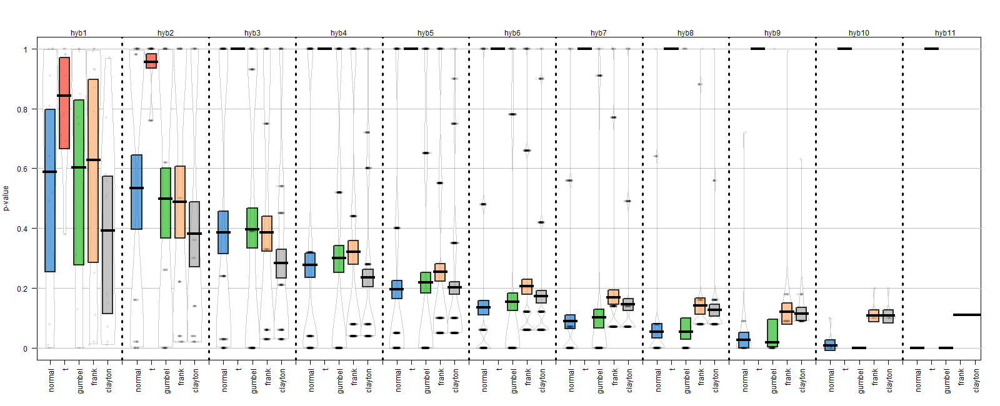

## gofCopula: Goodness-of-Fit Tests for Copulae

This R-package is a fire-and-forget software for Goodness-of-Fit (GoF) tests for Copulae. It consists of 16 tests and a Hybrid test, which allows for an informed decision about the functional form of the Copula. Estimation methods for the margins are provided and all the tests support parameter estimation and predefined values. The parameters are estimated by pseudo maximum likelihood but if it fails the estimation switches automatically to inversion of Kendall's tau. The package features in-build parallelization of the bootstrapping tasks, seed control for full reproducibility of the results and allows for the integration of user-specified GoF tests. The latter allows for the creation of new GoF tests and a benchmarking study of the new test with the package. 

We introduce the package as well as the tests implemented in the paper [*"gofCopula: Goodness-of-Fit Tests for Copulae"*](https://papers.ssrn.com/sol3/papers.cfm?abstract_id=3560825).

### Installation

To install the package from GitHub, you need to have the devtools package
installed in R. If you do not have it installed already, run this code line:
```
install.packages("devtools")
```
Next, load the devtools package: 
```
library(devtools)
```
Now, you are all set to install the gofCopula package. Just run this code line 
in your R console and you are good to go: 
```
install_github("SimonTrimborn/gofCopula")
```

### Workflow & Output 

The package supports 16 different tests and a hybrid test. To get started with 
the analysis of your dataset, you could either try some of the individual tests
```
gofKendallCvM(copula = "normal", x = YourDataHere, M = 100)
```
or run several tests at once and get automatically the results from the hybrid 
test as well:
```
gof(YourDataHere, priority = "tests", copula = "normal", 
tests = c("gofRosenblattSnB", "gofRosenblattSnC"), M = 100)
```
If you run several tests at once, analysing the results in a console output 
could be tedious. Therefore the results from ```gof()``` can be plotted 
for convenient analysis:
```
plot(YourResultFromGof)
```
The plotting function would provide a plot like this one: 



For more details on the workflow and the output, please see the paper [*"gofCopula: Goodness-of-Fit Tests for Copulae"*](https://papers.ssrn.com/sol3/papers.cfm?abstract_id=3560825). 

### Reference

When using the code in your own work, please reference to our paper. 
Thank you in advance!: 

Okhrin, O., Trimborn, S., Waltz, M., (2020) gofCopula: Goodness-of-Fit Tests 
for Copulae 

The manuscript can be found here: [view paper](https://papers.ssrn.com/sol3/papers.cfm?abstract_id=3560825)